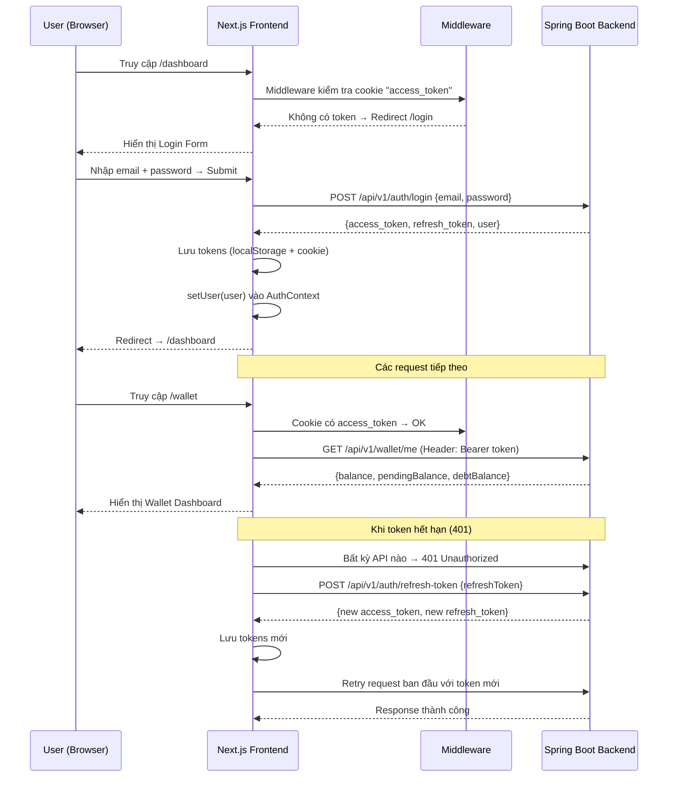
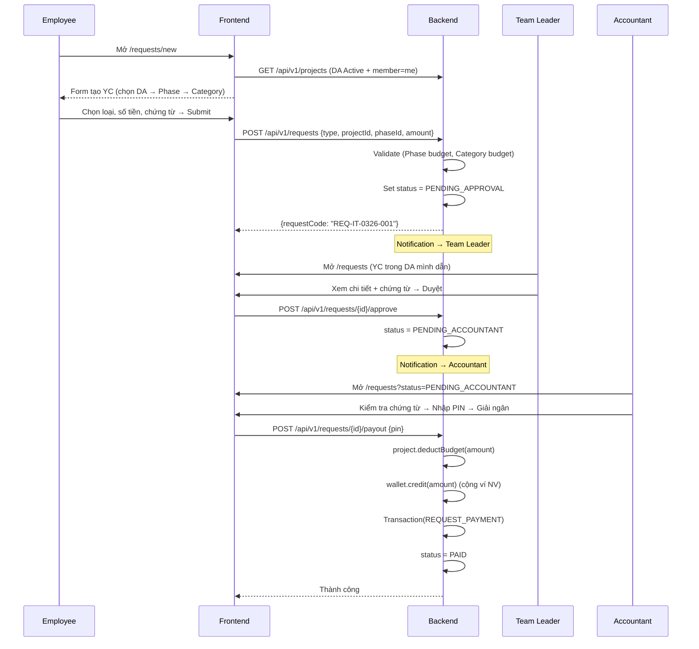
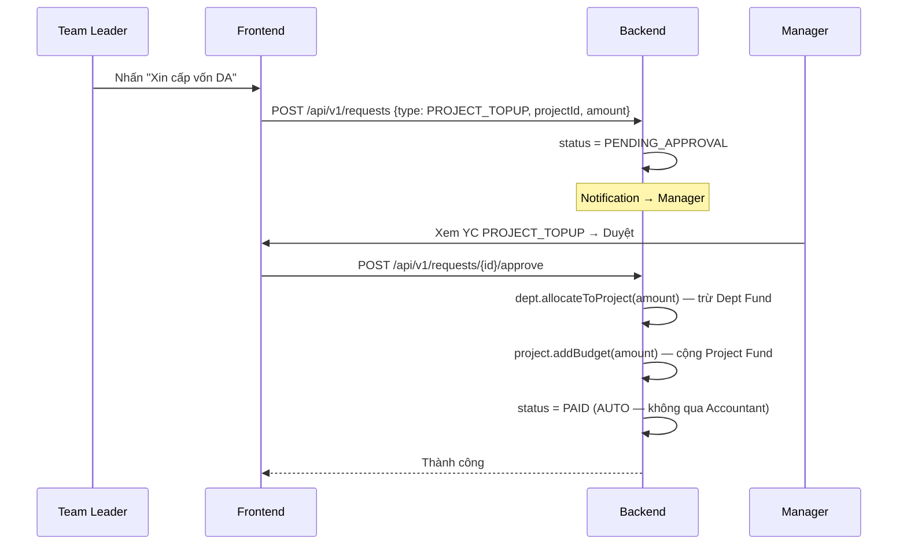
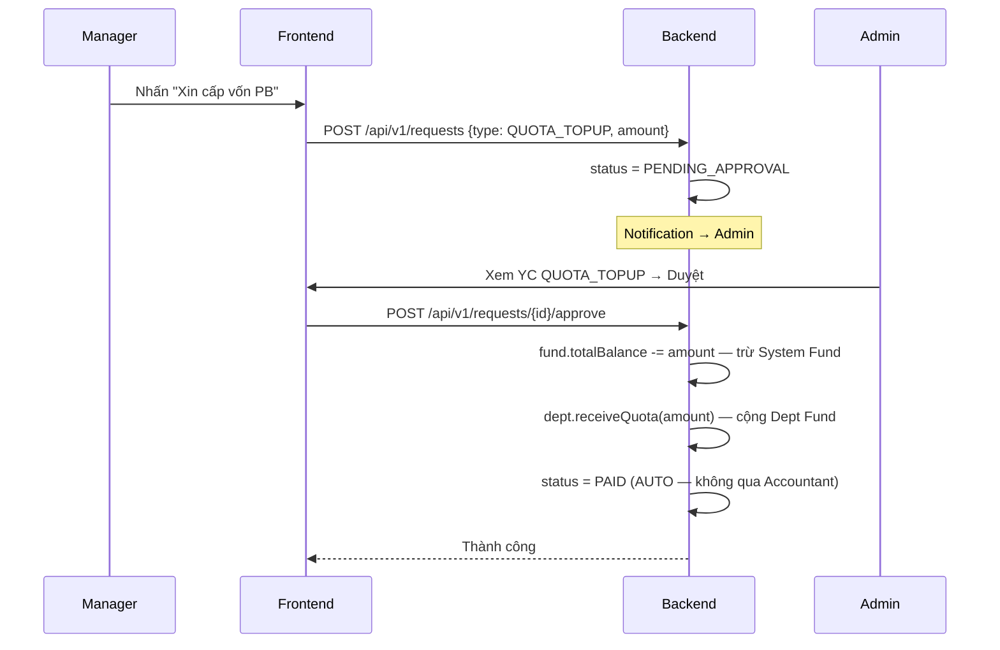
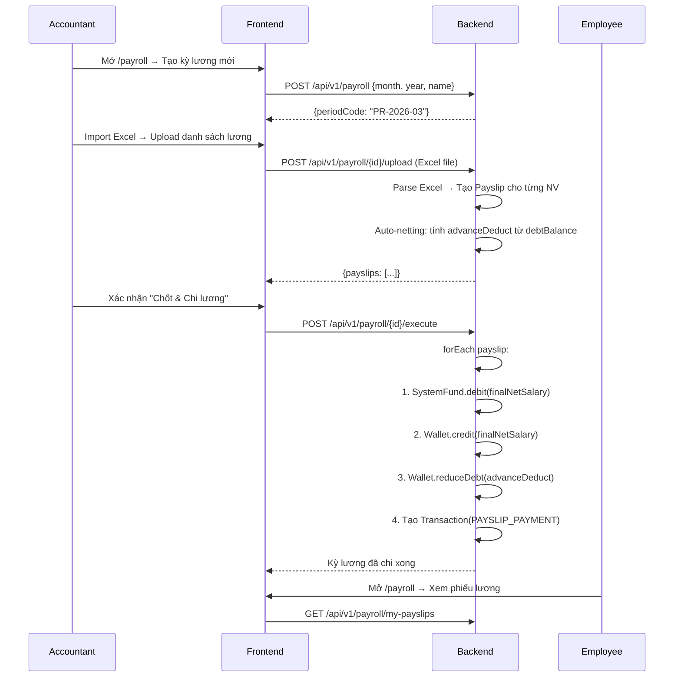

# FLOW.md — Luồng dữ liệu (Data Flow)

## 1. Tổng quan kiến trúc

```
┌─────────────────────────────────┐
│   BROWSER (Next.js Frontend)    │
│   http://localhost:3000         │
├─────────────────────────────────┤
│  app/  │  lib/api-client.ts     │
│  pages │  → fetch("/api/v1/..") │
└────────┬────────────────────────┘
         │ Proxy (next.config.ts rewrites)
         ▼
┌─────────────────────────────────┐
│   Spring Boot Backend           │
│   http://localhost:8080         │
├─────────────────────────────────┤
│  Controller → Service → Repo   │
│  → MySQL/PostgreSQL DB          │
└─────────────────────────────────┘
```

## 2. Luồng xác thực (Authentication Flow)



## 3. Luồng yêu cầu — Ủy quyền Tuyệt đối (Absolute Delegation)

> **Kiến trúc mới**: 5 vai trò — 3 luồng duyệt — 4 tầng quỹ — KHÔNG leo thang.
> Mỗi loại yêu cầu có **1 người duyệt duy nhất**, xác định bởi `request.type`.

### 3.1 Cấu trúc 4 tầng quỹ

```
System Fund (Admin quản lý, Accountant nạp)
    ↓ Flow 3: Admin duyệt QUOTA_TOPUP
Department Fund (Manager quản lý)
    ↓ Flow 2: Manager duyệt PROJECT_TOPUP
Project Fund (Team Leader quản lý Phase/Category)
    ↓ Flow 1: TL duyệt → Accountant giải ngân
Personal Wallet (NV sử dụng)
```

### 3.2 Flow 1 — Chi tiêu cá nhân (ADVANCE / EXPENSE / REIMBURSE)



### 3.3 Flow 2 — Cấp vốn Dự án (PROJECT_TOPUP)



### 3.4 Flow 3 — Cấp vốn Phòng ban (QUOTA_TOPUP)



### 3.5 Bảng tóm tắt 3 Flow

| Flow | Type | Người tạo | Approver | Giải ngân | Dòng tiền |
|------|------|-----------|----------|-----------|-----------|
| 1 | ADVANCE/EXPENSE/REIMBURSE | Employee/TL | **Team Leader** | **Accountant (PIN)** | Project → Wallet |
| 2 | PROJECT_TOPUP | Team Leader | **Manager** | **Auto** | Dept → Project |
| 3 | QUOTA_TOPUP | Manager | **Admin** | **Auto** | System → Dept |

## 4. Luồng lương (Payroll Flow)



## 5. Server Component vs Client Component

| Trường hợp | Dùng | Lý do |
|------------|------|-------|
| Trang list (danh sách) | **Server** | Fetch data server-side, SEO, bảo mật token |
| Trang detail (chi tiết) | **Server** | Fetch chỉ 1 record, bảo mật |
| Form nhập liệu | **Client** | Cần `useState`, `onChange`, `onSubmit` |
| Dashboard với wallet | **Client** | Cần Context (useWallet, useAuth) |
| Upload file | **Client** | Cần File API, progress tracking |

## 6. Cách data chảy trong code

```
User clicks button
  → Client Component event handler (onClick)
  → api.post("/api/v1/...", body) — lib/api-client.ts
  → next.config.ts rewrites → proxy to localhost:8080
  → Spring Boot Controller receives request
  → Service layer processes business logic
  → Repository saves to Database
  → Controller returns ApiResponse<T>
  → api-client.ts unwraps ApiResponse
  → Component updates state / UI
```
