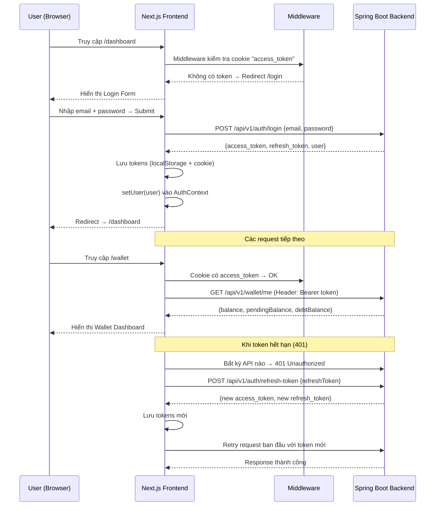
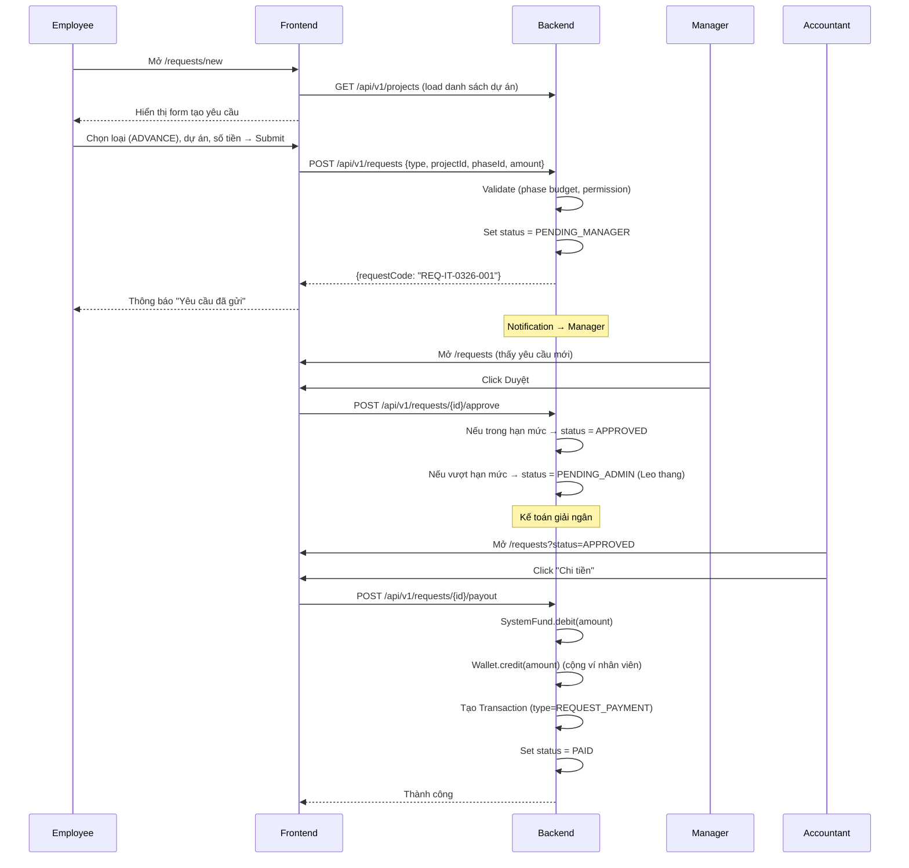
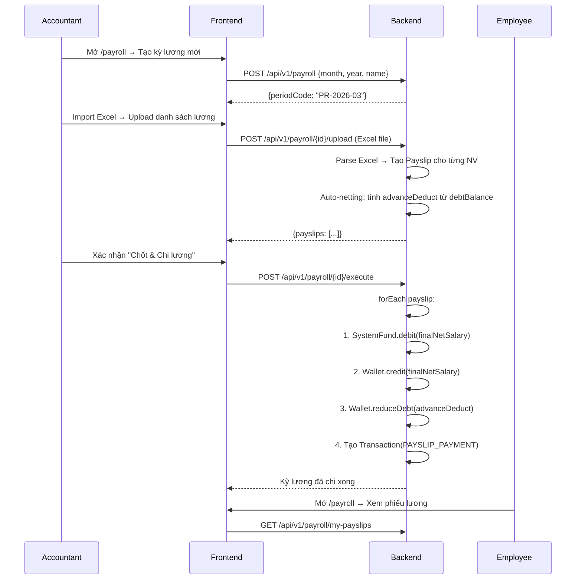

# FLOW.md — Luồng dữ liệu (Data Flow)

## 1. Tổng quan kiến trúc

```
┌─────────────────────────────────┐
│   BROWSER (Next.js Frontend)    │
│   http://localhost:3000         │
├─────────────────────────────────┤
│  app/  │  lib/api-client.ts     │
│  pages │  → fetch("/api/v1/..") │
└────────┬────────────────────────┘
         │ Proxy (next.config.ts rewrites)
         ▼
┌─────────────────────────────────┐
│   Spring Boot Backend           │
│   http://localhost:8080         │
├─────────────────────────────────┤
│  Controller → Service → Repo   │
│  → MySQL/PostgreSQL DB          │
└─────────────────────────────────┘
```

## 2. Luồng xác thực (Authentication Flow)



## 3. Luồng tạo yêu cầu (Request Flow)



## 4. Luồng lương (Payroll Flow)



## 5. Server Component vs Client Component

| Trường hợp | Dùng | Lý do |
|------------|------|-------|
| Trang list (danh sách) | **Server** | Fetch data server-side, SEO, bảo mật token |
| Trang detail (chi tiết) | **Server** | Fetch chỉ 1 record, bảo mật |
| Form nhập liệu | **Client** | Cần `useState`, `onChange`, `onSubmit` |
| Dashboard với wallet | **Client** | Cần Context (useWallet, useAuth) |
| Upload file | **Client** | Cần File API, progress tracking |

## 6. Cách data chảy trong code

```
User clicks button
  → Client Component event handler (onClick)
  → api.post("/api/v1/...", body) — lib/api-client.ts
  → next.config.ts rewrites → proxy to localhost:8080
  → Spring Boot Controller receives request
  → Service layer processes business logic
  → Repository saves to Database
  → Controller returns ApiResponse<T>
  → api-client.ts unwraps ApiResponse
  → Component updates state / UI
```
