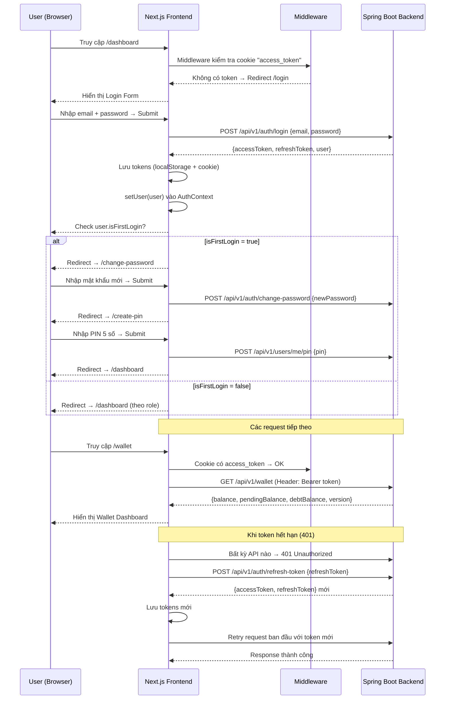
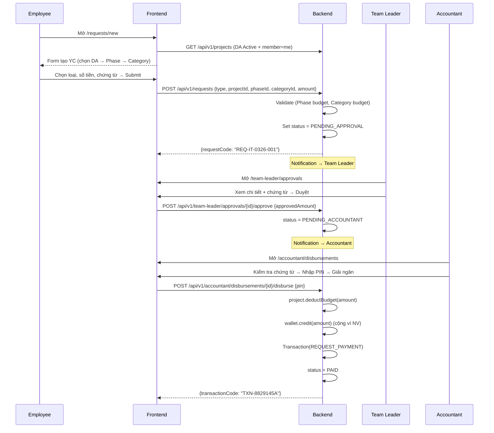
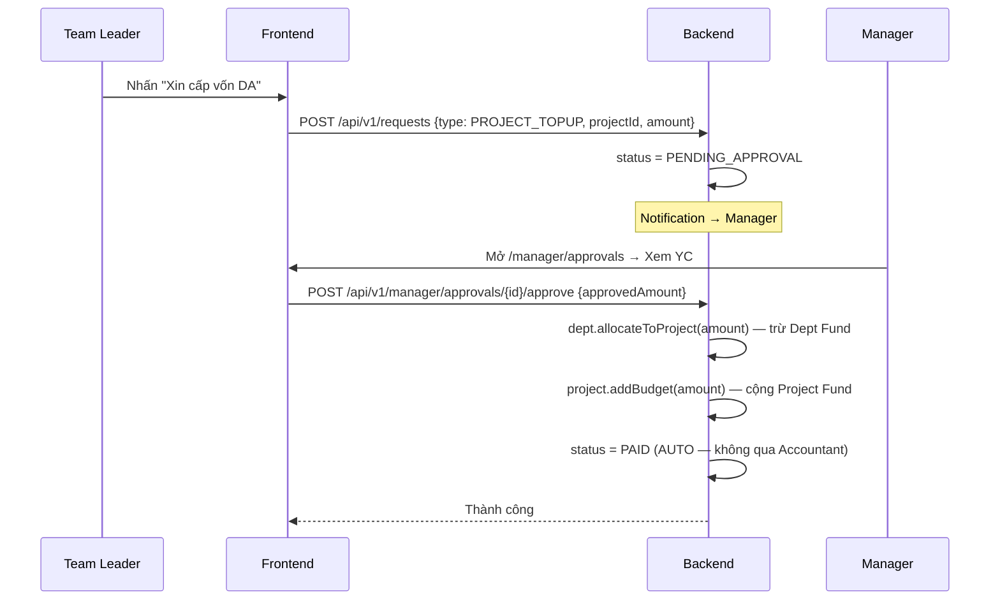
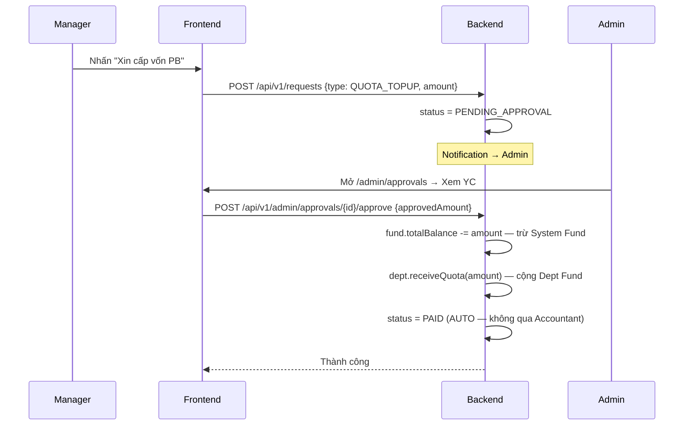
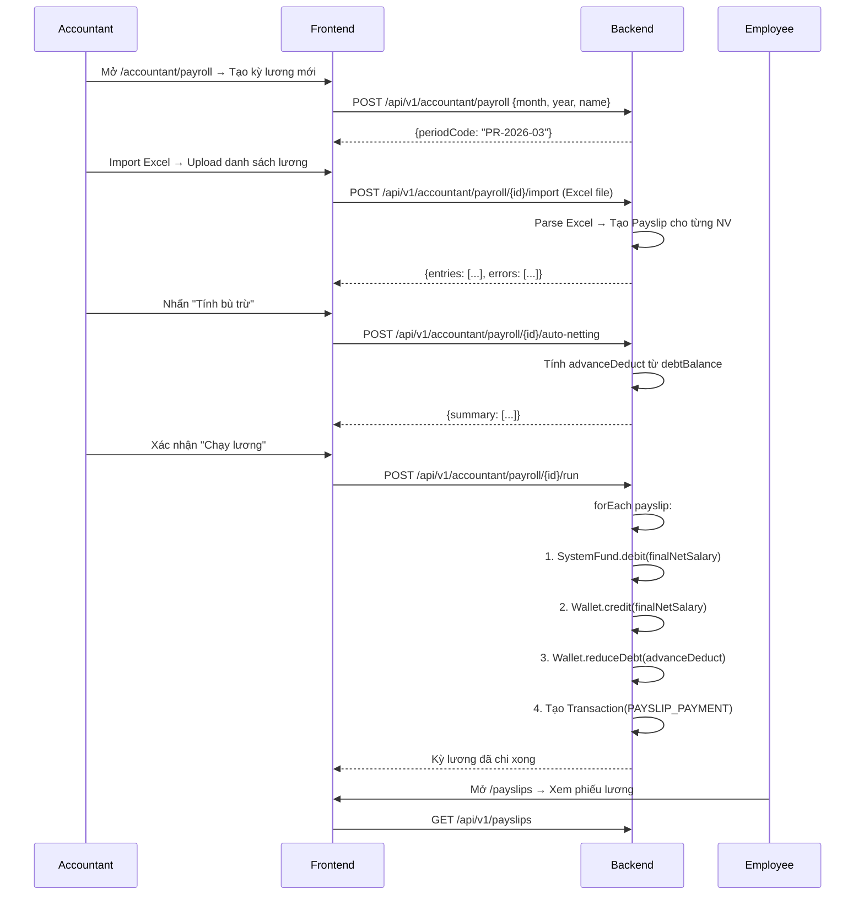

# FLOW.md — Luồng dữ liệu (Data Flow)

> **Version:** 2.0 — Aligned với Backend `API_Spec.md` v2.0
> **Kiến trúc:** 5 Roles — 3 Luồng duyệt — 4 Tầng quỹ — KHÔNG leo thang

## 1. Tổng quan kiến trúc

```
┌─────────────────────────────────┐
│   BROWSER (Next.js Frontend)    │
│   http://localhost:3000         │
├─────────────────────────────────┤
│  app/  │  lib/api-client.ts     │
│  pages │  → fetch("/api/v1/..") │
└────────┬────────────────────────┘
         │ Proxy (next.config.ts rewrites)
         ▼
┌─────────────────────────────────┐
│   Spring Boot Backend           │
│   http://localhost:8080         │
├─────────────────────────────────┤
│  Controller → Service → Repo   │
│  → PostgreSQL DB                │
└─────────────────────────────────┘
```

## 2. Luồng xác thực (Authentication Flow)



## 3. Hệ thống 5 Vai trò & 4 Tầng quỹ

```
┌──────────────────────────────────────────────────────────┐
│                    5 VAI TRÒ (ROLES)                     │
├──────────┬───────────┬─────────┬────────────┬────────────┤
│ EMPLOYEE │TEAM_LEADER│ MANAGER │ ACCOUNTANT │   ADMIN    │
│ Tạo YC   │Duyệt Flow1│Duyệt F2│ Giải ngân  │ Duyệt F3  │
│ chi tiêu │Quản lý DA │Quản lý │ Chi lương  │ Quản trị  │
│          │Phase/Categ│ PB     │ Sổ cái    │ Hệ thống  │
└──────────┴───────────┴─────────┴────────────┴────────────┘

┌──────────────────────────────────────────────────────────┐
│                 4 TẦNG QUỸ (FUND TIERS)                  │
├──────────────────────────────────────────────────────────┤
│ Tier 1: System Fund (Admin quản lý, Accountant nạp)     │
│    ↓ Flow 3: QUOTA_TOPUP (Manager → Admin duyệt)       │
│ Tier 2: Department Fund (Manager quản lý)               │
│    ↓ Flow 2: PROJECT_TOPUP (TL → Manager duyệt)        │
│ Tier 3: Project Fund → Phase → Category Budget          │
│    ↓ Flow 1: TL duyệt → Accountant giải ngân (PIN)     │
│ Tier 4: Personal Wallet (Nhân viên sử dụng)            │
└──────────────────────────────────────────────────────────┘
```

## 4. Flow 1 — Chi tiêu cá nhân (ADVANCE / EXPENSE / REIMBURSE)



## 5. Flow 2 — Cấp vốn Dự án (PROJECT_TOPUP)



## 6. Flow 3 — Cấp vốn Phòng ban (QUOTA_TOPUP)



## 7. Bảng tóm tắt 3 Flow

| Flow | Type | Người tạo | Approver | Giải ngân | Dòng tiền |
|------|------|-----------|----------|-----------|-----------| 
| 1 | ADVANCE/EXPENSE/REIMBURSE | Employee/TL | **Team Leader** | **Accountant (PIN)** | Project → Wallet |
| 2 | PROJECT_TOPUP | Team Leader | **Manager** | **Auto** | Dept → Project |
| 3 | QUOTA_TOPUP | Manager | **Admin** | **Auto** | System → Dept |

## 8. Luồng lương (Payroll Flow)



## 9. Server Component vs Client Component

| Trường hợp | Dùng | Lý do |
|------------|------|-------|
| Trang list (danh sách) | **Server** | Fetch data server-side, SEO, bảo mật token |
| Trang detail (chi tiết) | **Server** | Fetch chỉ 1 record, bảo mật |
| Form nhập liệu | **Client** | Cần `useState`, `onChange`, `onSubmit` |
| Dashboard với wallet | **Client** | Cần Context (useWallet, useAuth) |
| Upload file | **Client** | Cần File API, progress tracking |

## 10. Cách data chảy trong code

```
User clicks button
  → Client Component event handler (onClick)
  → api.post("/api/v1/...", body) — lib/api-client.ts
  → next.config.ts rewrites → proxy to localhost:8080
  → Spring Boot Controller receives request
  → Service layer processes business logic
  → Repository saves to Database
  → Controller returns ApiResponse<T>
  → api-client.ts unwraps ApiResponse
  → Component updates state / UI
```
